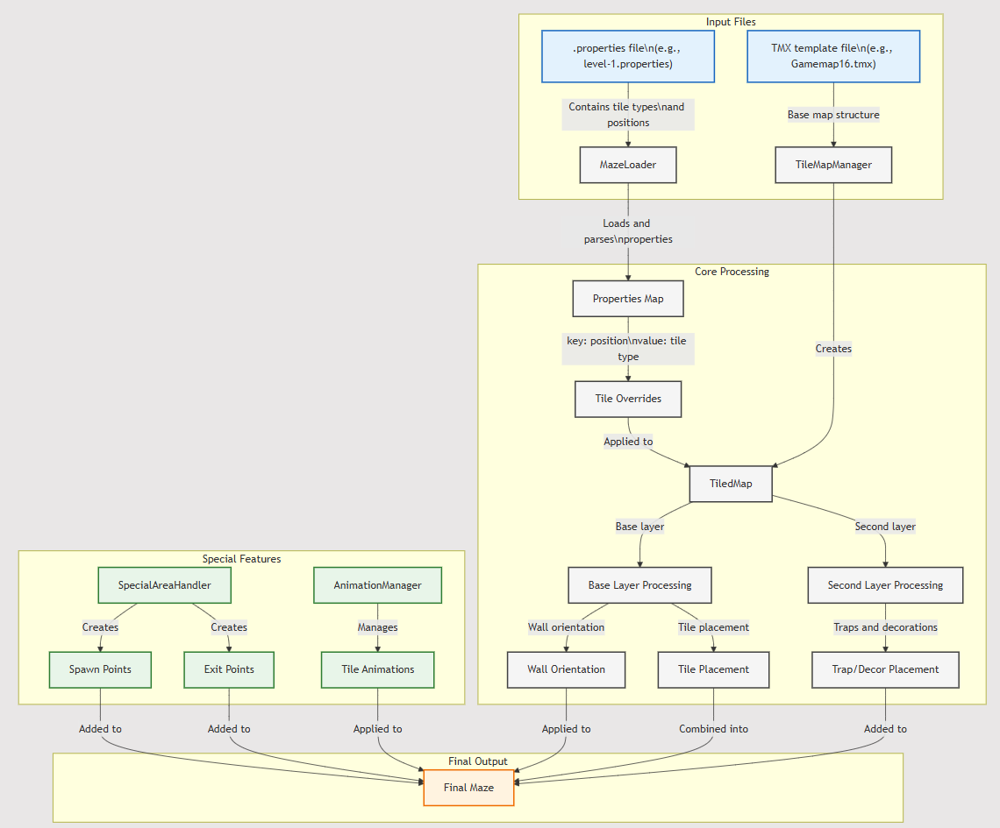

# Cedrics Luck Escape 🎲

[](https://www.oracle.com/java/)
[](https://libgdx.com/)

A maze-based dungeon crawler that combines classic roguelike elements with innovative dice mechanics. Navigate through procedurally enhanced mazes, engage in tactical combat, and use your dice rolls wisely to progress through increasingly challenging levels.

## ✨ Features

- **Advanced Combat System**
  - Real-time melee combat with spacebar-triggered attacks
  - Directional combat system with different attack patterns based on player orientation
  - Fireball projectile system with 3-second cooldown
  - Enemy AI featuring A* pathfinding and tactical positioning
  - Dynamic hit particle effects and damage feedback
  - Screen shake system with variable intensity based on damage
  - Invulnerability frames during dash maneuvers

- **Strategic Movement**
  - Fluid tile-based movement with WASD controls
  - Sprint system with 100-point stamina bar
  - Advanced dash mechanic with multiple charges
    - Maximum 3 base dash charges
    - 5-second cooldown per charge
    - Temporary dash power-ups available
  - Dynamic collision detection with multiple environment layers

- **Interactive Game Elements**
  - Dice-based progression system
    - Roll-to-unlock mechanics for exits
    - Score accumulation through successful rolls
    - Varying requirements per level
  - Power-up system with multiple effect types
  - Health management with collectible hearts
  - Multi-layered trap system with various effects

- **Polished Game Mechanics**
  - Smooth camera system with:
    - Dynamic zoom (0.2x to 1.0x range)
    - Intelligent follow mechanics
    - Screen shake with three intensity levels
  - Directional exit pointer system
  - Multi-layer map system supporting:
    - Base terrain layer
    - Interactive objects layer
    - Special areas (spawn points, exits)
  - Comprehensive animation system for all game entities

## 👾 Game Controls

**🏃Movement System**
-Basic Movement: Use WASD keys to navigate through the maze.
-Sprint: Hold Left Shift to move faster, consuming stamina.
-Dash: Press X to quickly evade or close gaps (uses dash charges).
-Collision Detection: The game implements a layered tile-based collision system to restrict movement where necessary.

**⚔️ Combat System**
-Melee Attack: Press Spacebar to deal close-range damage.
-Fireball Attack: Press Enter to launch a projectile (3-second cooldown).

## 🚀 Getting Started

### Prerequisites

- Java Development Kit (JDK) 17 or higher
- Gradle 7.0 or higher
- IDE with LibGDX support (IntelliJ IDEA recommended)
- Minimum 2GB RAM
- Graphics card supporting OpenGL 2.0

### Installation

1. Clone the repository:
```bash
git clone https://github.com/yourusername/diddy-party-escape.git
```

2. Navigate to project directory:
```bash
cd TBD
```

3. Build the project:
```bash
./gradlew build
```

4. Run the game:
```bash
./gradlew run
```

## 🎮 How to Play

1. **Game Start**
  - Launch the game
  - Navigate through the welcome screen
  - Select your preferred level from the menu
  - Levels are categorized by difficulty and size

2. **Core Objectives**
  - Each level has a dice requirement to unlock the exit
  - Collect dice and roll them to accumulate points
  - Find and reach the exit point marked by the pointer
  - Manage resources while avoiding or defeating enemies

3. **Progression System**
  - Complete levels to unlock harder challenges
  - Each level features:
    - Unique maze layouts
    - Varying enemy patterns
    - Special trap configurations

4. **Combat Strategy**
  - Use melee attacks for close combat
  - Employ fireballs for ranged combat
  - Utilize dash for both offense and defense
  - Manage your dash charges strategically

## ⌨️ Game Controls

- **Basic Movement**: WASD keys
- **Sprint**: Hold Left Shift (consumes stamina)
- **Melee Attack**: Spacebar
- **Dash**: X (requires dash charges)
- **Fireball**: Enter (3-second cooldown)
- **Camera Control**:
  - Zoom In/Out: Mouse Scroll
  - Camera follows player automatically

## 🔧 Technical Details

The game is built using LibGDX and features:

- **Map System**
  - TMX-based level design
  - Property-driven configuration
  - Multi-layer support for:
    - Base terrain
    - Interactive elements
    - Trap systems
  - Special area handling for spawns and exits

- **Animation Framework**
  - State-based animation system
  - Direction-aware sprite management
  - Particle effect integration
  - Screen shake coordination

- **Enemy AI**
  - A* pathfinding implementation
  - Dynamic target tracking
  - State machine for behavior
  - Collision avoidance

- **Resource Management**
  - Health system (max 200 points)
  - Stamina system (100 points)
  - Dash charge system
  - Score tracking + 5 for each heart + 10 for each enemy killed

## 📐 Design and Screens
Design Overview
The design of Diddy Party Escape is built on a pixel-art aesthetic using the Dawnlike tileset by DawnBringer. The game follows a top-down dungeon-crawler style, incorporating grid-based movement while allowing dynamic actions such as dashing, shooting fireballs, and interacting with various in-game elements like dice and hearts.
The UI elements are minimalistic and effective, with a focus on clear feedback for actions like health status, score tracking, and game progression. The animations are handled by AnimationMNGR, ensuring smooth transitions for player movements, enemy interactions, and dice mechanics.

1. **Welcome Screen**
  -Implements a line-by-line narrative progression system, where text unfolds dynamically based on player input.
  -Rendered on a dedicated Stage with viewport scaling, ensuring sharp text readability across resolutions

2. **Menu Screen**
  -Features a 181-frame animated sequence background, stitched dynamically using LibGDX’s Animation API.
  -Interactive elements (buttons) using custom skin assets with adaptive UI scaling and hover/click reactivity.
   
3. **Pause Menu Screen**
  -Implements a semi-transparent black overlay with alpha blending, ensuring background visibility while maintaining focus on the pause menu.
  -Operates as an independent class, preserving input states without interfering with game rendering.

4. **Game Screen**
  -The primary execution layer, responsible for player interactions, AI, physics, and environment rendering.
  -Implements a modular rendering pipeline, ensuring that UI elements, animations, and map tiles update asynchronously.
    -Camera system features:
      -Smooth tracking with velocity-based easing.
      -Zoom interpolation (0.2x to 1.0x) for a dynamic perspective shift.
      -Screen shake logic tied to damage values, delivering impactful feedback.

5. **Victory Screen**
  -Fires completion events upon reaching objectives, triggering the level transition system.
    -Automated level progression:
        -Checks for next available level and dynamically loads it or returns to the menu.
        -Updates the UI with new score requirements and level details.
        -Resets player stats and positions for a fresh new level start.

6. **Game UI**
  -Real-time health tracking with color-coded scaling (White → Orange → Red) based on damage thresholds.
  -Door unlock progress indicator dynamically updates based on dice roll results, creating a real-time puzzle-solving feedback loop.


## 📁 Project Structure

```
diddy-party-escape/
├── core/
│   ├── src/
│   │   ├── screens/           # Game screens (Menu, Game, Welcome)
│   │   ├── pc_npc_obj/       # Game entities (Player, Enemy, Items)
│   │   ├── mazelogic/        # Core systems (Pathfinding, Collision)
│   │   └── design/           # Visual systems (Animation, Effects)
├── assets/
│   ├── maps/                 # Level TMX files and properties
│   ├── textures/            # Sprite sheets and particles
│   └── audio/               # Sound effects and music
├── desktop/                 # Desktop launcher and configurations
└── README.md
```

## 🤝 Contributing

1. Fork the repository
2. Create a feature branch (`git checkout -b feature/AmazingFeature`)
3. Commit changes (`git commit -m 'Add AmazingFeature'`)
4. Push to branch (`git push origin feature/AmazingFeature`)
5. Open a Pull Request

Please ensure new features maintain compatibility with existing systems and include appropriate documentation.

## 📝 Development Updates

## Update 1
Construction of the game scaffold.

## Update 2 (ver 0.1.0)

### Overview
Finally discovered the issue of the improper movement of the player. The player was restricted to the actual size of the map in pixels, and later when "upscaling" the map, the movement boundaries remained the same. Added new files like a `.md` file, configuration class, class that fixes TiledTileIDs, and manages tiles properties. Added a new copyright-free tile set `Dawnlike.tmx` (created by DawnBringer), and some other assets for testing. Made slight adjustments across other classes to support the new features.

### Changes

#### Files

**New:**
- `gameCONFIG.java` - Stores future game settings (like `UNIT_SCALE`, etc.).
- `README.md` - Stores development notes.
- `TilePropMngr.java` - Manages the properties of the Tiled tiles.
- `TMapTileIDAdjuster.java` - During the Tiled Software export process, the IDs of the tiles on the map get incremented by 1, causing bugs. This class fixes this by incrementing back by 1. (As of this moment, it is not being used, but will still push it.)
- `Gamemap.tmx` - New map used for development testing.
- `Dawnlike.tsx` - New copyright-free tile set created by DawnBringer.
- `TilesNew.png`
- `bush.png` - New icon for testing the character movement and mechanics.

**Old:**
- Tuned the following classes to support the new features: `Background.java`, `GameScreen.java`, `Labyrinth.java`, `Player.java`.

**Removed:**
- `FOP_test.tmx`

## Update 3 (ver 0.2.0)

### Overview
Major update of player movement and combat systems. Implemented enemy pathfinding, player combat mechanics, animation systems, and level management. Added multiple map sizes with proper property files. Introduced damage system, hit particles, and basic UI elements. New features include dash mechanics, health tracking, and development improvements across multiple systems.

### Changes

#### Files

**New:**
- `AnimationMNGR.java` - Handles all game animations including character movement and combat
- `CameraMNGR.java` - Camera control system with zoom and follow mechanics
- `Enemy.java` - Enemy AI with pathfinding and combat behaviors
- `GameUI.java` - Health bars and game interface elements
- `HitParticle.java` - Combat effect visualization system
- `LevelMNGR.java` - Level loading and management system
- `MovementREQ.java` - Movement request handling system
- `MovementSYS.java` - Core movement processing system
- `Pathfinding.java` - A* pathfinding implementation for enemy AI
- Level property files (level-1.properties through level-5.properties) - Map configurations
- `SoundMNGR.java` - Audio management system (preliminary)

**Modified:**
- `Player.java` - Added combat mechanics, health system, and animation states
- `GameScreen.java` - Updated to support new combat and movement systems
- `Background.java` - Enhanced to support multiple map sizes
- `MazeRunnerGame.java` - Added support for level management and UI systems
- `MenuScreen.java` - Updated to support level selection
- Other supporting classes adjusted for new systems

**Misc:**
- Due to major code conflicts with video animation loading at MenuScreen initialization, this push won't feature Djordje's update on this aspect of the game. This push is to summarize the progress of the team and provide helpful insight behind the development process of Team `Byteme`

## Update 4 (ver 0.3.0)
### Overview
Major update implementing collectible system and minigame mechanics. Added new interactive elements including dice-based minigames, enhanced particle effects, and projectile combat system. Expanded the game's combat mechanics with fireball abilities and improved visual feedback systems. Implemented Player Spawn locations and Player Exit locations. Added support for Trap game mechanics. Support for a second tile layer is added(crucial for the Trap System). Reworks of other classes to support this update.

### Changes

#### Files

**New:**
- `Collectable.java` - Base abstract class for all collectible items in the game. Implements core collection mechanics and bounds checking. Provides foundation for future collectible types

- `Dice.java` - Polished the design of the dice rolling animation. Small reworks.

- `DiceMinigame.java` - Complete dice rolling minigame system. Handles dice animation states and result generation. Manages game duration and result display. Features customizable difficulty through roll duration

- `FireBall.java` - Projectile combat system. Implements directional projectile movement. Handles collision detection with enemies and walls. Features animated projectile effects. Includes damage system integration

- `TrapMNGR.java` - A manager class that handles trap objects - parsing of .properties files for trap location in the maze, manages the trap types, spawning and mechanics associated with them.

- `SpecialAreaHNDLR.java` - A handler class that is responsible for the Player Spawn Area, Level Exit Area, the design of these areas.


**Modified:**
- `Player.java`
  - Added fireball shooting mechanics
  - Implemented cooldown system for abilities
  - Enhanced combat interaction with new projectiles
  - Integrated collectible detection system

- `Enemy.java`
  - Updated to handle projectile damage
  - Enhanced hit detection system
  - Improved death state handling

- `AnimationMNGR.java`
  - Added new animations for dice and fireballs
  - Implemented directional projectile animations
  - Enhanced hit particle effects

- `MazeLoader.java`
  - Reworks for the support of the new Trap System and for the Special Areas.

- `Background.java`
  - Reworks for the support of the new Trap System and for the Special Areas.
- Other supporting classes adjusted for the new systems.

**Misc:**
- The classes are separated into new packages(contextually named) to improve development process.
- Wall width of 64x64 maps is doubled to 2 tiles wide.
- Corridors` walking area inside the maze is doubled to 2 tiles wide.
- Reversion of the updates number

## Update 5 (0.3.1)
### Overview
- Fixed bugs occurring when creating the Special Areas, across several classes
- Updated the level-2,4.properties files

## Update 6 (0.3.2)
### Overview
- Fixed camera issues, fixed zoom
- Improved camera movement, improved player movement(tile-to-pixel movement)
- Implemented screen shake
- Added more levels

# Update 7 (0.4.0)
#### Overview
- Fixed numerous bugs - spawning of the traps and power-ups, interactions with the player; Overall maze loading 
- Reworked mechanics - Reworked: sprinting system, dash system, dice system,  next level progression, trap and power-up effects, connected the screen shake to the game logic, smoothened movement of enemies + better pathfinding logic
- Introduced new features - Player gets red when taking damage, 
- New proper documentation
- New skins for traps and power-ups

## 🙏 Acknowledgments
- LibGDX framework and community
- [DawnBringer](https://pixeljoint.com/p/23821.htm) for the Dawnlike tileset
- Sound effects from freesound.org
- Claude AI, ChatGPT, DeepSeek
- All contributors and testers

## Authors
- Mark Konstantinov
- Andrei Iulian Maftei
- Djordje Vidakovic


# Technical Deep Dive: MAZELOGIC Package

Loading Pipeline of game files
```java
File Processing Flow:
┌───────────────┐
│ .properties   │
│ File Loading  │
└───────┬───────┘
        ▼
┌───────────────┐
│ Coordinates   │
│ Parsing       │
└───────┬───────┘
        ▼
┌───────────────┐
│ Tile Type     │
│ Assignment    │
└───────────────┘
```

[Processing scheme ](docs/file_processing_scheme.png)

[DependencyGraphSnapshot0.svg](..%2F..%2FDesktop%2FJArchitect2024.1%2FDependencyGraphSnapshot0.svg)

### Wall Orientation System
The maze uses a bitmask system to determine wall orientations:
```java
Direction Bits:
N = 1 (0001)  E = 2 (0010)
S = 4 (0100)  W = 8 (1000)
Example Combinations:
┌─────────┬────────┬──────────┐
│ Pattern │ Binary │ Tile ID  │
├─────────┼────────┼──────────┤
│ Cross   │  1111  │   265    │
│ Horiz   │  1010  │   242    │
│ Vert    │  0101  │   261    │
└─────────┴────────┴──────────┘
```

### Movement System
#### Three-layer approach:
```java
Movement Flow:
┌──────────────┐
│ Input Layer  │ MovementREQ.java
│  (Intent)    │ - STEP/DASH/KNOCKBACK
├──────────────┤
│ Processing   │ MovementSYS.java
│  (Physics)   │ - Collision/Position
├──────────────┤
│ Output Layer │ Vector2 Position
│ (Position)   │ - Final Coordinates
└──────────────┘
```

```java
Movement State Machine:
┌─────────────┐
│   IDLE      │──────┐
├─────────────┤      │
│   WALKING   │<─────┼───────┐
├─────────────┤      │       │
│   DASHING   │      │       │
└─────────────┘      │       │
                     │       │
Movement Request     │       │
┌─────────────┐      │       │
│ Type        │      │       │
│ DeltaTileX  │>─────┘       │
│ DeltaTileY  │              │
└─────────────┘              │
                             │
Validation                   │
┌─────────────┐              │
│ Collision   │>─────────────┘
│ Boundaries  │
│ State Check │
└─────────────┘
```

### Movement Interpolation System
#### Overview
```java
 Pipeline:
┌─────────────┐
│ Input       │ Raw position change
├─────────────┤
│ Lerp        │ Smooth transition
├─────────────┤
│ Output      │ Final position
└─────────────┘

```
Why Interpolation?
Problem Without Interpolation
Instant jump between tiles causes:
1. Visual jarring
2. Loss of motion feel
3. Reduced game polish


Benefits of using Interpolation:
1. Visual smoothness
2. Better game feel
3. Professional polish
   Linear Interpolation (Lerp)
   Basic Formula
4. CopyLerp Formula:
   ``current = start + (target - start) * alpha``

Where:
- start: Starting position
- target: Target position
- alpha: Interpolation factor (0 to 1)

Implementation
 ```java
- Movement Components:
  ┌──────────────────┐
  │ Position         │
  ├──────────────────┤
  │ currentPos: Vec2 │
  │ targetPos:  Vec2 │
  │ alpha:     float │
  └──────────────────┘
```
```java
Update Cycle:
┌────────────────────┐
│ alpha += speed * dt│
│ if alpha > 1       │
│   alpha = 1        │
└────────────────────┘
Delta Time Integration
javaCopyTime Management:
┌───────────────┬────────────┐
│ Component     │ Purpose    │
├───────────────┼────────────┤
│ deltaTime     │ Frame time │
│ moveSpeed     │ Base speed │
│ currentAlpha  │ Progress   │
└───────────────┴────────────┘
```

Speed Calculation:

`speed = baseSpeed * deltaTime`


Interpolation Implementation Example
```java
public class MovementInterpolator {
private Vector2 currentPos;
private Vector2 targetPos;
private float alpha;
private float speed;

    public void updatePosition(float deltaTime) {
        // Update alpha
        alpha += speed * deltaTime;
        if (alpha > 1f) alpha = 1f;

        // Interpolate position
        currentPos.x = lerp(startPos.x, targetPos.x, alpha);
        currentPos.y = lerp(startPos.y, targetPos.y, alpha);
    }

    private float lerp(float start, float target, float alpha) {
        return start + (target - start) * alpha;
    }
}

```
#### Implementation Example in Game
```java
public class MovementREQ {
    public enum MoveType { STEP, DASH, KNOCKBACK }
    public MoveType moveType;
    public int deltaTileX;
    public int deltaTileY;
}
```

### Wall Bitmask System
```java
Direction Values:
N = 1 (0001)    ↑
E = 2 (0010)    →
S = 4 (0100)    ↓
W = 8 (1000)    ←

Common Patterns:
┌──────────┬────────┬─────┬────────┐
│ Pattern  │ Binary │ Sum │ Visual │
├──────────┼────────┼─────┼────────┤
│ Cross    │  1111  │ 15  │   ┼    │
│ T-shape  │  1110  │ 14  │   ┤    │
│ Corner   │  0011  │  3  │   └    │
│ Straight │  1010  │ 10  │   ─    │
└──────────┴────────┴─────┴────────┘

Example:
To check if a wall has a northern connection:
bitmask & NORTH (1) != 0
```

### Pathfinding Implementation

```java
A* pathfinding system visualization:
(S) to Goal (G):
        
┌───┬───┬───┬───┐
│ S │   │ ■ │   │
├───┼───┼───┼───┤
│   │ ■ │   │   │
├───┼───┼───┼───┤
│   │   │ ■ │ G │
└───┴───┴───┴───┘
■ = Wall
```

### Tile Effect Management
#### Structure of effect system:
```java
┌─────────────┐
│ TileEffect  │
├─────────────┤
│ - TrapType  │
│ - PowerUp   │
└─────────────┘
Implementation:
enum TrapType {
    POISON(2080, "Poison", 5f),
    STING(2082, "Sting", 10f),
    HEAVY_BLOW(2085, "Heavy blow", 40f)
}
```

### Special Area Management
The game uses an area generation system utilizing bitmasks and tile overrides:

```java
Area generation pattern:
Copy3x3 Special Area:
┌───┬───┬───┐
│ C │ E │ C │ C = Corner
├───┼───┼───┤ E = Edge
│ E │ S │ E │ S = Special
├───┼───┼───┤    (Spawn/Exit)
│ C │ E │ C │
└───┴───┴───┘
```

```java
Area Components:
┌─────────────┐  ┌─────────────┐
│ Spawn Area  │  │  Exit Area  │
├─────────────┤  ├─────────────┤
│ 3x3 Grid    │  │ 3x3 Grid    │
│ Portal Tile │  │ Door Tile   │
│ Safe Zone   │  │ Unlock Zone │
└─────────────┘  └─────────────┘

Tile Override Map:
┌───┬───┬───┐
│1,1│1,2│1,3│ Each cell contains:
├───┼───┼───┤ - Base tile ID
│2,1│2,2│2,3│ - Properties
├───┼───┼───┤ - Effect markers
│3,1│3,2│3,3│
└───┴───┴───┘
```


### Camera System Architecture
The camera management system consists of three core components working in tandem:

```java
Camera Components:
┌──────────────────┐
│ Follow System    │
├──────────────────┤
│ currentPos Vec2  │
│ targetPos  Vec2  │
│ lerpSpeed  float │
└──────────────────┘

┌──────────────────┐
│ Zoom Control     │
├──────────────────┤
│ minZoom    float │
│ maxZoom    float │
│ zoomSpeed  float │
└──────────────────┘

┌──────────────────┐
│ Screen Shake     │
├──────────────────┤
│ duration   float │
│ intensity  float │
│ decay      float │
└──────────────────┘
```

### Tile Effect System
The game features a comprehensive effect management system:

```java
Effect Hierarchy:
┌─────────────┐
│ BaseEffect  │
├─────────────┼───────────┐
│ TrapEffect  │ PowerUp   │
├─────────────┤           │
│ - Poison    │ - Dash    │
│ - Sting     │ - Health  │
│ - Heavy     │ - Speed   │
└─────────────┴───────────┘

Effect Registration:
Position Hash = x + y * mapWidth

Effect Storage:
┌─────────────┬──────────┐
│ Position    │ Effect   │
├─────────────┼──────────┤
│ (1,1)       │ POISON   │
│ (5,3)       │ DASH     │
│ (2,4)       │ STING    │
└─────────────┴──────────┘
```
## Implementation Notes

1. All position calculations are done using tile coordinates internally and converted to pixel coordinates only for rendering
2. Effect systems use a hash-based lookup for O(1) access time
3. Camera interpolation uses delta time for smooth movement regardless of frame rate
4. Special area generation is done once during level load to minimize runtime overhead


# Technical Deep Dive: PC_NPC_OBJ Package
# Technical Deep Dive: PC_NPC_OBJ Package

## Inheritance Structure
```
┌──────────────┐
│  IGameOBJ    │
└──────┬───────┘
       │
┌──────┴───────┐
│ Collectable  │
├──────────────┴───┐
│      Heart       │
│      Dice        │
└──────────────────┘
```
# Technical Deep Dive: Dice System Architecture

## Core Components

### Collectible Base Class
The Dice system inherits from the Collectable abstract class, providing:
```java
- Position tracking (x, y)
- Collection state management
- Abstract update/render methods
```

### Dice Class Key Features
```java
public class Dice extends Collectable {
    private AnimationMNGR animationMNGR;
    private float time = 0f;
    private boolean minigameActive = false;
    private Sound diceCollectedSound;
}
```

### DiceMinigame Class Features
```java
public class DiceMinigame {
    private boolean active;
    private float time;
    private float activeDuration = 2.0f;
    private int diceResult = -1;
    private boolean showingResult;
}
```

## State Management System

### Collection States
```
State Flow:
┌──────────┐    ┌──────────┐    ┌───────────┐
│Available │───►│Collected │───►│MinigameOn │
└──────────┘    └──────────┘    └───────────┘

Code Implementation:
if (!collected && playerOnSameTile) {
    collected = true;
    minigameActive = true;
    diceCollectedSound.play();
}
```

### Minigame States
```
Roll States:
┌─────────┐    ┌─────────┐    ┌──────────┐
│ Start   │───►│Rolling  │───►│ Result   │
└─────────┘    └─────────┘    └──────────┘

Timing:
- Roll Duration: 2.0 seconds
- Result Display: 1.5 seconds
```

## Animation System

### Rolling Animation
```java
// Update animation frame
currentFrame = animationMNGR.getDiceAnimation()
                           .getKeyFrame(time, true);

// Render with offset for centering
batch.draw(currentFrame, 
    centeredX, centeredY,  // Position 
    8, 8                   // Size
);
```


### Player Movement & Combat System

```java
Input Processing Pipeline:
┌────────────┐    ┌────────────┐    ┌────────────┐
│   Input    │    │ Movement   │    │ Animation  │
│ Detection  │───>│ Processing │───>│  Update    │
└────────────┘    └────────────┘    └────────────┘

Combat States:
┌──────────────┐
│    Normal    │
├──────────────┤
│    Hitting   │
├──────────────┤
│   Dashing    │
├──────────────┤
│ Firing Ball  │
└──────────────┘
```

Features:
1. Stamina system with regeneration
2. Dash mechanic with invulnerability frames
3. Direction-based animation system
4. Damage flash effect with tinting

### Enemy AI System

```java
Pathfinding Pipeline:
┌────────────┐    ┌────────────┐    ┌────────────┐
│ Player Pos │    │   A* Path  │    │ Movement   │
│ Detection  │───>│ Generation │───>│ Execution  │
└────────────┘    └────────────┘    └────────────┘

State Management:
┌───────────────┐
│ Path Planning │
├───────────────┤
│   Movement    │
├───────────────┤
│Combat Response│
└───────────────┘
```

Features:
1. A* pathfinding implementation
2. Dynamic target tracking
3. Smooth animation transitions
4. Health management system

### FireBall System

```java
Direction Controls:
┌───┬───┬───┐
│   │ ↑ │   │
├───┼───┼───┤
│ ← │   │ → │
├───┼───┼───┤
│   │ ↓ │   │
└───┴───┴───┘

Collision Detection:
┌────────────┐    ┌────────────┐    ┌────────────┐
│ Movement   │    │ Collision  │    │   Effect   │
│ Update     │───>│   Check    │───>│ Application│
└────────────┘    └────────────┘    └────────────┘
```
Featuers:
1. Direction-based animation system
2. Collision detection with walls and enemies
3. Damage application system

### Heart Collection System

```java
Collection Process:
┌────────────┐    ┌────────────┐    ┌────────────┐
│ Proximity  │    │ Collection │    │   Health   │
│   Check    │───>│  Trigger   │───>│   Update   │
└────────────┘    └────────────┘    └────────────┘
```

Features:
1. Sound feedback on collection
2. Animation system for idle state
3. Tile-based position checking

## Advanced Features

### Dash Mechanic
```java
Dash Implementation:
┌────────────────────┐
│ Input Detection    │
├────────────────────┤
│ Charge Management  │
├────────────────────┤
│ Movement Execution │
├────────────────────┤
│ Invulnerability    │
└────────────────────┘

Dash States:
- Available (dashCharges > 0)
- Cooldown (recharging)
- Active (moving)
- Recovery (post-dash)
```

### Stamina System
```java
Stamina Pipeline:
┌────────────┐    ┌────────────┐    ┌────────────┐
│   Usage    │    │ Depletion  │    │   Regen    │
│ Detection  │───>│ Calculation│───>│   Timer    │
└────────────┘    └────────────┘    └────────────┘

Constants:
MAX_STAMINA = 100f
DRAIN_RATE = 50f
REGEN_RATE = 20f
REGEN_DELAY = 1.5f
```

### Combat & Damage System
```java
Damage Application:
┌────────────┐    ┌────────────┐    ┌────────────┐
│   Damage   │    │   Effect   │    │  Visual    │
│ Calculation│───>│ Application│───>│  Feedback  │
└────────────┘    └────────────┘    └────────────┘

Visual Effects:
- Damage flash with color tinting
- Camera shake based on damage
- Hit particles
- Knockback effect
```

### Animation Optimization
1. Shared AnimationMNGR instance
2. Texture region reuse

### Collision Detection
1. Grid-based checks
2. Rectangle overlap tests 
3. Bounds updates

# Technical Deep Dive: SCREENS Package


# Technical Deep Dive: DESIGN Package

Design package includes the AnimationMNGR class, that is used to load the textures of all the elements that are part of the game

Features - the loading is broken into different parts - player, hit and dice animations, that are separated in order to maintain an efficient running during the game. 

It creates sprite sheets for all the elements in the game


